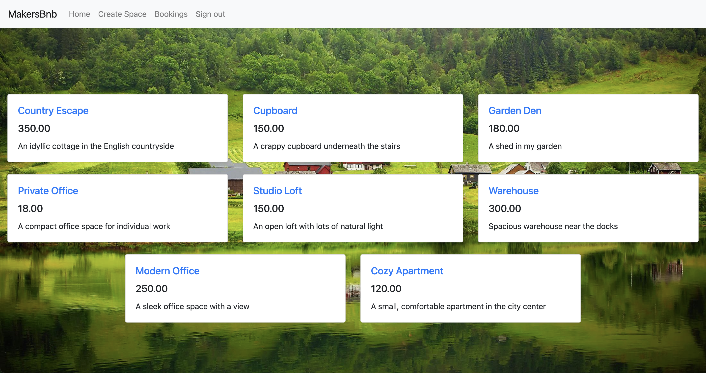
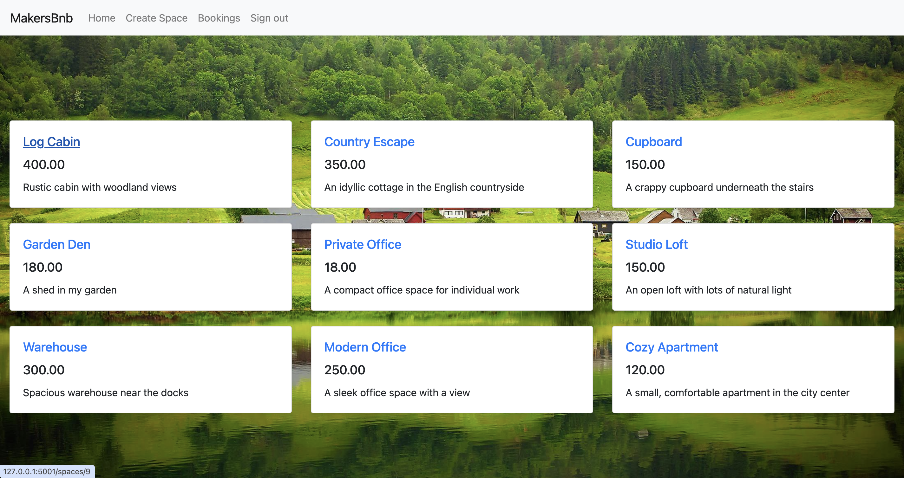

# MakersBnB 🏡  
> A team-built, server-rendered Airbnb-style web app for listing, viewing, and booking spaces – with Flask, PostgreSQL, and Bootstrap.


---

## 🚀 Demo

Local only – run and visit: [http://localhost:5001](http://localhost:5001)

📸 **Screenshots**
| Page | Preview |
|------|---------|
| 🛬 Landing |  |
| 🔐 Login |  |
| 🆕 Register |  |
| 🚫 Invalid Password |  |
| ✅ Account Created |  |
| 🏠 Spaces Page |  |
| ➕ Create Space |  |
| ✔️ Space Created |  |
| 🗂 New Space Displayed |  |
| 📅 Booking Flow |  |

---

## ✅ Features

- 🧾 Register/login with secure password hashing (SHA256)
- 📌 Create a new space with name, description, and price
- 🏡 View all listed spaces (public for all users)
- 📆 Submit booking requests for specific dates
- 🔁 Booking logic prevents selection of unavailable (already confirmed) dates
- 📋 “My Bookings” view scoped to logged-in user
- 💄 Styled using Bootstrap 5 (semi-responsive)
- 🧪 Built with TDD using pytest and repository pattern

---

## 🛠 Tech Stack

| Layer       | Tech                          |
|-------------|-------------------------------|
| Frontend    | HTML, CSS, Bootstrap 5        |
| Backend     | Python 3, Flask               |
| Database    | PostgreSQL                    |
| Testing     | Pytest, Playwright            |
| Auth        | Sessions + SHA256 password hash |
| Dev Tools   | Virtualenv, Trello, Agile ceremonies |

---

## 🧱 Architecture

- MVC-style Flask app with a Repository pattern — domain models encapsulate business logic, repositories handle persistence, controllers are Flask routes, and views are Jinja templates  
- PostgreSQL database with 3 core models: users, spaces, bookings  
- Routes split into auth, space, and booking flows  
- Bootstrap styling + session-based login management  

```
app.py ── Flask routes
│
├── templates/          # HTML views
├── static/             # CSS, Bootstrap
├── lib/				# Domain models, repository classes
│   ├── user.py
│   ├── user_repository.py
│   ├── booking.py
│   ├── booking_repository.py
│   ├── space.py
│   ├── space_repository.py
│   └── database_connection.py
├── tests/              # Pytest tests
├── seeds/              # SQL seed data
└── requirements.txt
```

---

## 🔌 Internal Routes

| Method | Route                     | Purpose                          |
|--------|---------------------------|----------------------------------|
| GET    | `/`                       | Landing page                     |
| GET    | `/login`, `/register`     | Auth forms                       |
| POST   | `/login`, `/register`     | Auth submission                  |
| GET    | `/spaces`                | List all spaces                  |
| GET    | `/create_space`          | Show create form                 |
| POST   | `/create_space`          | Submit new space                 |
| GET    | `/spaces/<id>`           | View individual space            |
| GET    | `/booking/<space_id>`    | Book a space                     |
| POST   | `/post_booking/<space_id>` | Submit booking request        |
| GET    | `/user_bookings/`        | View own bookings                |
| GET    | `/booking_complete/<id>` | Booking confirmation page        |
| GET    | `/booking_confirmed/<id>`| Confirm booking manually         |

---

## 🧰 Getting Started

```bash
# Clone the repo
git clone https://github.com/RobertMcIsaac/MakersBnB.git
cd MakersBnB

# Create and activate virtual environment
python -m venv makersbnb-venv
source makersbnb-venv/bin/activate

# Install dependencies
pip install -r requirements.txt

# Install Playwright for browser tests
playwright install

# Create databases
createdb makersbnb_dev
createdb makersbnb_test

# 🔧 Edit `lib/database_connection.py` to point to your local DB names

# Seed the database (optional)
psql makersbnb_dev < seeds/air_makersbnb_test.sql

# Run tests
pytest -sv

# Run the app
python app.py
# Now visit http://localhost:5001
```


---

## 🧪 Testing

We followed a TDD process using **pytest** to validate backend logic and database interactions.

- **Unit tests** cover repositories (users, spaces, bookings).
- **Integration tests** validate database interactions and booking flows.

To run all tests:
```bash
pytest -sv
```

To run browser tests:
```bash
pytest -sv tests/e2e
```

---

## 📝 Design Decisions & Trade-offs

- **Flask (server-rendered)**: Chosen for simplicity and speed over a full frontend framework. Trade-off: limited interactivity vs. React.
- **Sessions + SHA256**: Lightweight auth, no OAuth/JWT complexity. Trade-off: not production-grade security.
- **PostgreSQL**: Strong relational DB suited for bookings and availability. Trade-off: setup complexity vs. SQLite.
- **Bootstrap 5**: Allowed rapid styling. Trade-off: mobile responsiveness is partial, not fully optimized.

---

## 🛣 Roadmap / Improvements

- [ ] Mobile-first responsive design
- [ ] Improved booking UX with live calendar filtering
- [ ] User dashboards (spaces + bookings)
- [ ] Deployment via Heroku or Docker
- [ ] Replace password hashing with industry-standard libraries (bcrypt/argon2)
- [ ] CI/CD with GitHub Actions

---

## 📄 License

This project is licensed under the MIT License. See `LICENSE` for details.

---

## 👀 Recruiter Snapshot

- **Type**: Full-stack, team-built project
- **Stack**: Flask, PostgreSQL, Bootstrap, Pytest
- **Highlights**:
  - Secure auth with sessions + password hashing
  - Repository pattern with clean separation
  - Booking logic prevents double-booking
  - Team Agile workflow with Trello + TDD

---

## 🤝 Contributing

Contributions are welcome! Please:

1. Fork the repo
2. Create a feature branch: `git checkout -b feature/my-feature`
3. Commit changes: `git commit -m 'Add new feature'`
4. Push branch: `git push origin feature/my-feature`
5. Open a Pull Request